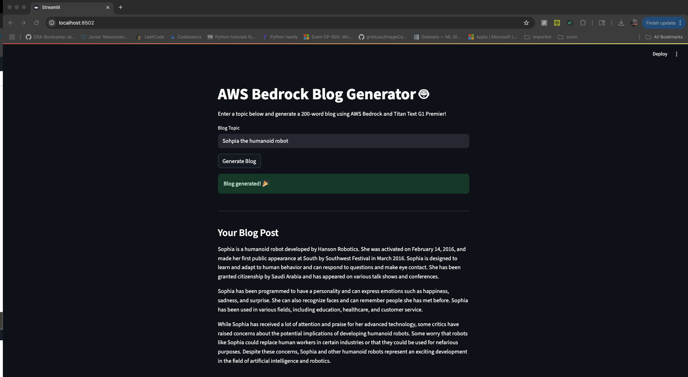

# TitanBlogGen

Automate high-quality blog creation using AWS Lambda, API Gateway, Amazon Bedrock, and Amazon Titan Text Premier v1.0.

---

## System Architecture

TitanBlogGen is a serverless, cloud-native application for generating blog content with state-of-the-art generative AI.

**Workflow:**

1. **API Call** (via Postman or frontend) triggers a blog generation request.
2. **Amazon API Gateway** receives the request and routes it to **AWS Lambda**.
3. **AWS Lambda** processes the request and calls **Amazon Bedrock**.
4. **Amazon Bedrock** generates blog content using  
   **Amazon Titan Text Premier v1.0** (`amazon.titan-text-premier-v1:0`).
5. **Lambda** stores the generated blog post in **Amazon S3** and returns the result.


---

---

## Features

- AI-powered blog content creation using Amazon Titan Text Premier v1.0
- Fully serverless on AWS: Lambda, API Gateway, Bedrock, and S3
- Customizable input (topic, keywords, style)
- Scalable and cost-effective architecture

---

## Getting Started

### 1. Clone the Repository

```bash
git clone https://github.com/vaidehi-613/GenAI_Blog_Generator.git
cd GenAI_Blog_Generator
